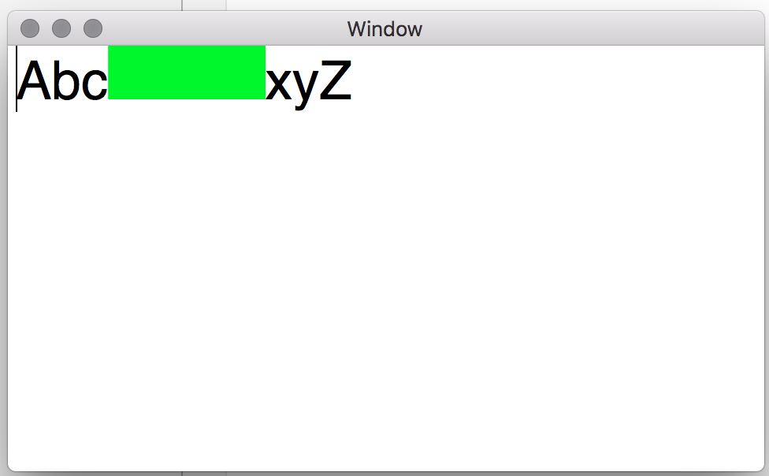
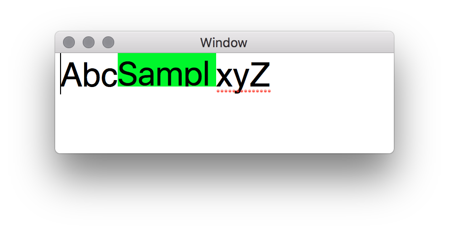
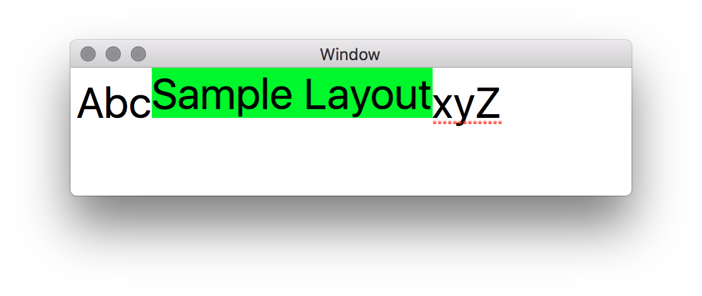

# Cocoa Text Attachment Cells

This project works through an example Cocoa project which creates ***NSTextAttachment*** cells which can be embedded within *attributed text views*. Whilst aimed at *OS X* Cocoa based applications the techniques presented here are equally applicable (in most places) to *iOS* apps.

## Creating Basic Attachments

Before we can get into producing any interesting code we need to setup the basic framework for displaying attributed text and showing a simple *cell*.   

For the purposes of this post we're going to create images to represent cell content, so the first step we need to do is create a test image for our cell. The easiest way to do this in Cocoa *(but not in UIKit)* is through the *NSImage* initialiser which takes a closure in which you can provide any drawing commands for the image.    

At this stage we can simply draw a filled box so we can see the impact clearly on the eventual attributed rendering.   
### Creating Test Image
 
	let img = NSImage(size: s, flipped: false) { (r) -> Bool in
            let p = NSBezierPath(rect: r)
            NSColor.greenColor().setFill()
            p.fill()
            return true
        }

### Creating Attachment Cell
Now we've got the ability to draw the cell content we can complete the *NSTextAttachmentCell* implementation - simply initialise with a size, create the test image with that size and call the superclass initialiser with that test image.

*We'll need to come back and change bits in this class a little later on*

	class TextDisplayCell : NSTextAttachmentCell {
    	var size : NSSize
        
        init(withSize s: NSSize) {
            self.size = s
            
            let img = NSImage(size: s, flipped: false) { (r) -> Bool in
                let p = NSBezierPath(rect: r)
                NSColor.greenColor().setFill()
                p.fill()
                return true
            }
            
            super.init(imageCell: img)
        }
        
        required init?(coder aDecoder: NSCoder) {
            fatalError("init(coder:) has not been implemented")
        }
        
        override func cellSize() -> NSSize {
            return size
        }   
	}

### Displaying the Attachment

Creating something which can be inserted into the editor view is now a simple matter of wrapping a cell of a specified size in an *NSTextAttachment* and then wrapping that within an *NSAttributedString*.

	let inline = TextDisplayCell(withSize: NSSize(width: 100, height: 34))
    let cell = NSTextAttachment()
    cell.attachmentCell = inline
    let cellstr = NSAttributedString(attachment: cell)

The full content of our View Controller now looks like the following - *note that the cellstr is inserted into the text storage element of the NSTextView instance*

    class ViewController: NSViewController {
        @IBOutlet var editor: NSTextView!
    
        override func viewDidLoad() {
            super.viewDidLoad()
    
            let inline = TextDisplayCell(withSize: NSSize(width: 100, height: 34))
            let cell = NSTextAttachment()
            cell.attachmentCell = inline
            let cellstr = NSAttributedString(attachment: cell)
            
            editor.textStorage?.replaceCharactersInRange(NSRange(location: 3, length: 0), withAttributedString: cellstr)
        }
    
    }

If you build and run the application at this stage you should see output like the following: -

.

### Displaying Text

Now we have the ability to display a simple cell we can start building out the real functionality of this post - starting with drawing text in the cell. *This may seem a little strange but stick with it and all will make sense in the end.*

The first change we need to make is to the *TextDisplayCell* to pass in more content to the initialiser as shown below: -

	init(withSize s: NSSize, forContent c: String, withFont font: NSFont) 	{
        self.size = s
        
        let img = NSImage(size: s, flipped: false) { (r) -> Bool in
            let p = NSBezierPath(rect: r)
            NSColor.greenColor().setFill()
            p.fill()
            (c as NSString).drawInRect(r, withAttributes: [NSFontAttributeName:font])
            return true
        }
        
        super.init(imageCell: img)
    }

We pass in a string to display and the font which want to use for the display and extend our image drawing code (leaving the fill so we can clearly see the cell layout bounds when displayed).

Update the view controller cell initialisation to the following then build and run the project.

        let inline = TextDisplayCell(withSize: NSSize(width: 100, height: 34), forContent: "Sample Layout", withFont: NSFont.systemFontOfSize(34))

You should see output matching the following. 

To fix the text sizing issue you can see here it's necessary to utilise a handy extension to string which calculates the rectangle necessary to display a full string. It requires that a text layout manager and text container be created and used to find the appropriate used rectangle for the associated string.

    extension String {
        func size(withAttributes attrs: [String:AnyObject], constrainedTo box: NSSize, padding: CGFloat = 0.0) -> NSSize {
            let storage = NSTextStorage(string: self)
            let container = NSTextContainer(containerSize: NSSize(width: box.width, height: box.height))
            let layout = NSLayoutManager()
            layout.addTextContainer(container)
            storage.addLayoutManager(layout)
            storage.addAttributes(attrs, range: NSMakeRange(0, storage.length))
            container.lineFragmentPadding = padding
            let _ = layout.glyphRangeForTextContainer(container)
            let ur = layout.usedRectForTextContainer(container)
            
            return NSSize(width: ur.width, height: ur.height)
        }
    }

Now update the cell initialisation code in the view controller to the following:-

 	let content = "Sample Layout"
    let cellSize = content.size(withAttributes: [NSFontAttributeName:NSFont.systemFontOfSize(34)], constrainedTo: NSSize(width: 5000, height: 5000))
    let inline = TextDisplayCell(withSize: cellSize, forContent: content, withFont: NSFont.systemFontOfSize(34))

*Note: the font and sizing here should match that set for the text view - it's not a requirement but will help to demonstrate some points we need to address and which can be seen in the following screenshot*

We've now got the correct width and height for the content but as can be seen the cell baseline is set to the text baseline so the drawn text doesn't follow the natural layout. This is actually quite a simple fix.

